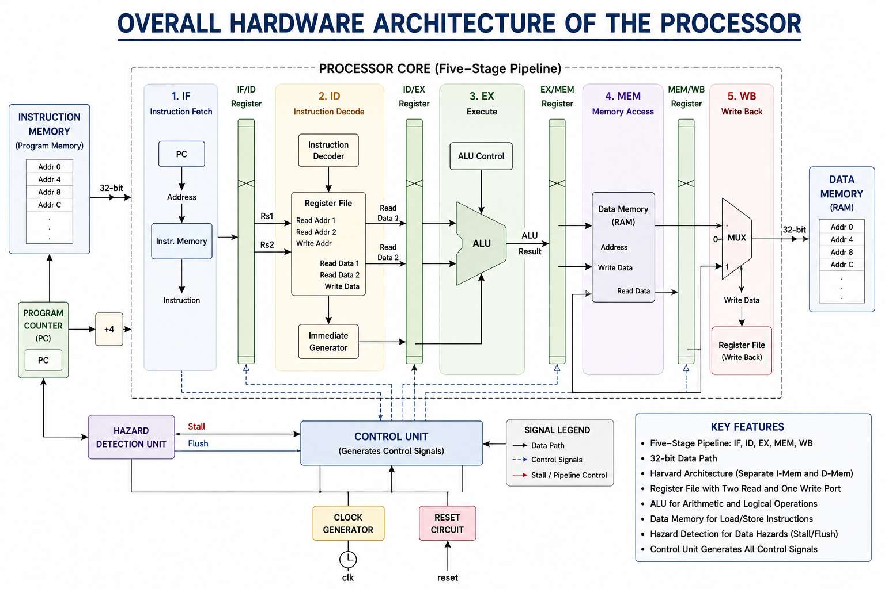
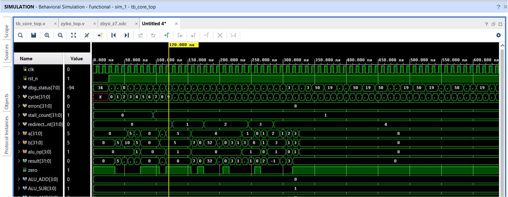
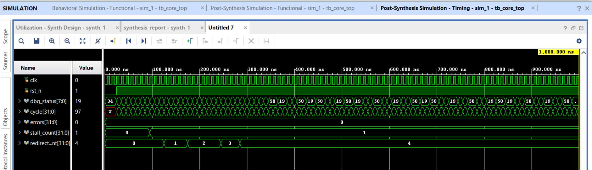

# RV32I 5-Stage Pipelined Processor (Zybo Z7 / Vivado)

A from-scratch, 5-stage pipelined RV32I RISC-V core in Verilog, verified in
simulation and synthesized/implemented for the Digilent Zybo Z7
(Zynq-7000, xc7z020clg400-1) using Xilinx Vivado.

Built as part of the NIELIT Chennai Online Internship in RTL Design using
Verilog HDL (June - July 2026). The full project report is available on
request.

**What's implemented:**
- Classic IF / ID / EX / MEM / WB pipeline with pipeline registers between
  every stage.
- EX/MEM and MEM/WB operand forwarding, so back-to-back dependent
  instructions don't stall.
- Load-use hazard detection with a single-cycle stall (the one case
  forwarding can't cover).
- Branch/jump resolution in EX with the correct two-instruction pipeline
  flush on a taken redirect.
- A self-checking testbench that verifies every register, the data memory,
  and the hazard/branch event counts against hand-decoded expected values
  - not just a visual waveform check.
- Meets timing at the board's 125 MHz system clock (WNS = +5.174 ns).
- 15 LUTs, 37 FFs on the xc7z020clg400-1 - reflects a single-issue,
  in-order core with no caches, no M-extension, no FPU.

No license file is included, so all rights are reserved by default -
open an issue if you want to use this under specific terms.

## Architecture



## Layout
```
.
├── src/
│   ├── alu.v            ALU: add/sub/logic/shift/compare/LUI
│   ├── decoder.v         instruction decode + immediate generation
│   ├── regfile.v         32x32 register file, write-first bypass
│   ├── imem.v             instruction memory, $readmemh at elaboration
│   ├── dmem.v            data memory, word-addressed
│   ├── core_top.v         pipeline top: stages, forwarding, hazard unit
│   ├── zybo_top.v         board wrapper - maps core_top onto Zybo Z7 pins
│   └── imem_init.hex      test program (see Verification below)
├── constraints/
│   └── zybo_z7.xdc        pin constraints, verified against Digilent's
│                          Zybo-Z7-Master.xdc
├── sim/
│   └── tb_core_top.v      self-checking testbench
├── docs/images/           figures used in this README
└── build_project.tcl      scripted Vivado project creation + build
```

## Building

**Scripted (fastest):**
```
vivado -mode batch -source build_project.tcl
```
Creates the Vivado project, adds all sources, sets `zybo_top` as top, and
runs synthesis → implementation → bitstream generation. Defaults to the
Zybo Z7-20 (`xc7z020clg400-1`); edit `part_name` near the top of the script
to `xc7z010clg400-1` if you have a Z7-10 (same constraints file works for
either).

**Through the GUI:** create a project targeting `xc7z020clg400-1`, add all
`.v` files from `src/` as design sources and `zybo_z7.xdc` as the
constraints source, mark `imem_init.hex` as a **Memory Initialization
File** (Source File Properties) so `$readmemh` in `imem.v` resolves during
synthesis and not just simulation, set `zybo_top` as top, then run the
normal Synthesis → Implementation → Generate Bitstream flow.

## Verification

`sim/tb_core_top.v` (add under **Simulation Sources**, not `sources_1` -
it isn't synthesizable) drives a hand-written test program covering every
architecturally significant event the pipeline needs to get right:
back-to-back ALU forwarding, the load-use stall, a taken and a not-taken
branch, an unconditional jump-and-link, and a counting loop. It checks
every register touched, the one data memory write, and the hazard/branch
event counts automatically - not just a waveform to eyeball.



`errors` stays at `0` for the whole run: `stall_count = 1` (the one
load-use hazard), `redirect_count = 4` (the taken branch, the jump, and
two taken loop iterations - the not-taken branch and the final loop exit
correctly don't count).

## Timing

Meets the board's 125 MHz system clock with substantial margin - worst
setup path is 2.826 ns against the 8 ns requirement:



## What's on the board

`zybo_top` uses only 7 of `dbg_status`'s 8 bits (the discrete LEDs plus
RGB LED6 - LED5 is Zybo Z7-20-only, so it's skipped for compatibility with
both board variants). BTN0 is the reset (active-high on the board,
inverted internally since `core_top` wants active-low). There's no clock
divider - the core runs directly off the 125 MHz system clock, so the
LEDs are a synthesis "keep-alive" and basic sanity check, not a real
debug UI. For actual pipeline visibility on hardware, a Vivado ILA
probing `pc_if`, `instr_id`, `stall`, and `pc_redirect` would be far more
useful.

## Known limitations / future work

- RV32I base only - no M (mul/div), C (compressed), F/D (float), or
  privileged/CSR support.
- Only word-aligned loads/stores - no `lb`/`lh`/`sb`/`sh`.
- No `jalr`, `ecall`/`ebreak` - needed for a standard GCC toolchain to
  target this core.
- No dynamic branch prediction - branches resolve in EX with a fixed
  2-cycle flush penalty on a taken redirect.
